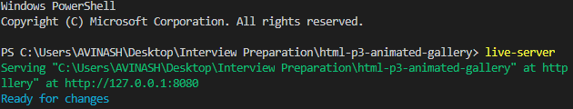
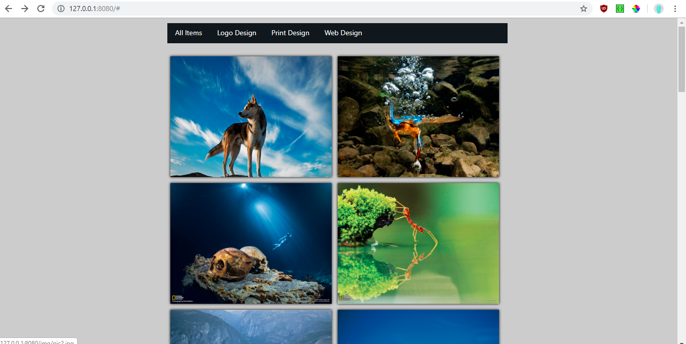
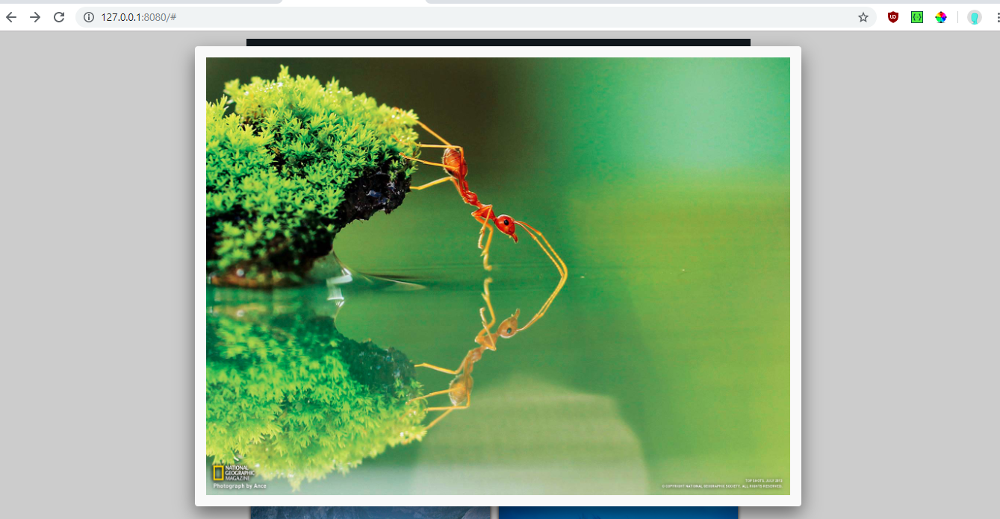

JQuery Gallery
===============================================================

A simple gallery to explore jquery animation possibilities

---------------------------------------------------------------

|                           |                            |
|---------------------------|----------------------------|
| Developer                 | Avinash Sorab              |
| Languages                 | HTML5, CSS3, JavaScript    |
| Frameworks and Libraries  | jQuery, FancyBox           |

<!-- TOC -->

- [Installation Instructions](#installation-instructions)
- [Screenshots](#screenshots)

<!-- /TOC -->

## Installation Instructions

- Make sure you have node and npm installed locally in your system.

- Run the below command
```
npm install -g live-server
```

- Open the project in visual studio code and navigate to the project folder in the integrated terminal

- Run the below command
```
live-server
```

- You should see the server start up on your computer locally on the port 8080



## Screenshots






> Feel free to reach me out for any help in installation at avinashsp93@gmail.com